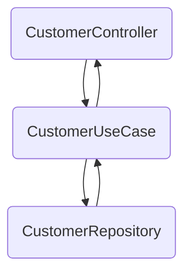

# Micro serviço de clientes

Este micro serviço foi construido usando o sdk tools do sprint boot

### Endpoins

A API é feita usando como base os conceitos de RESTFULL APIs. 
Ela tem um endpoint base configurado na aplicação que começa com `/api` e qualquer endpoint novo que for adicionado vai ter este prefixo. Tem num total de quatro **endpoints**:

1. **GET /customers**

   Endpoit utilizado para buscar todos os usuários da API.
   ```
   api/customers
   ```
2. **GET /customers/useridentifier**

   Busca um cliente informando um ID por parametro.
   ```
   api/customers/cbe2bd1a-48b3-4388-80ba-fbc6c4091897
   ```

   O retorno será um customer em json
   ```
    {
        "id": "cbe2bd1a-48b3-4388-80ba-fbc6c4091897"
        "name": "oie sou o nome",
        "city": "cidade da lua",
        "createdAt": "08/05/2022"
    }
   ```
3. **POST /customers**

   Cria um novo cliente passando os dados via json.
   ```
   api/customers
   ```

    ```
        {
            "name": "Juquinha da silva",
            "city": "Salvador"
        }  
    ```

4. **DELETE /customers/useridentifier**

   Faz a exclusão de um Customer informando o ID dele por parametro.
   ```
   api/customers/cbe2bd1a-48b3-4388-80ba-fbc6c4091897
   ```

## Arquitetura

O projeto foi desenhado seguindo os padrões do SOLID e Clean Architecture.  
A injeção de dependência é feita pelo proprio framework Spring, o que permite trabalharmaos bem o princípio da inversão de dependência.

### Camadas

Para melhor organização e seguindo o principio do Clean Architecture que diz, que as camadas mais internas e
independentes do sistema não pode ter nenhuma dependência com a camada mais externas.
Separamos em camada de **dados**, **dominio**, **controller**.

- Dados
    - Camada responsável por fazer toda comunição e integração com apis de dados (bando de dados, api de terceiros,
      entre outros). No projeto, a camada de dados é resposável por implementantar o contrato do JPA e definir a
      entidade `CustomerEntity` que é a representação da tabela `customers` no banco de dados.
    - A interface `CustomerRespository` implementa o contrato do `JpaRepository` que entrega de forma automatica as
      funções de `CRUD` do customer.
- Domain
    - Camada responsável pela lógica de negócio da aplicação, nela está contida os `UseCases` (Representação de um caso
      de uso) que realizarão as ações da nossa API. Esses UseCase se comunicam com a camada de dados para persistir ou
      recurperar dados importantes para a lógica de negocio da API.
    - `CreateCustomerUseCase` recebe os parametros de um novo `Customer`, gera um novo `Customer` atribui a ele a data
      de criação, data do dia em que foi criado, e gera um Identificador Universal Único (UUID) e atribui como
      identificador `id` para o novo `Customer` criado.
    - `DeleteCustomerUseCase` recebe o identificar de um customer, verifica com a camada de dados se já existe
      um `Customer` com o id informado, caso exista ele solicita a camada de dados para excluir esse Customer. Caso
      contrário ele lança uma exeção informando que não existe registro para o id informado.
    - `GetAllCustomersUseCase` use case que busca todos os clientes no banco de dados e retorna em uma lista.
    - `GetCustomerByIdUseCase` use case que recebe o `id` de um `Customer` como parâmetro e faz a busca no repository e
      retorna envolvido em um `Optional`, pois caso não exista é facil tratar sem precisar lançar uma exception na
      aplicação.
- Controller
    - Camada onde fica os controllers responsáveis por expor a api para o mundo, fazendo a conexão do cliente que vai
      consumir a api com as regras de negócio (os `UseCases`).

## Representação da comunicação entre classes e camadas. 


## Tecnologias Utilizada

- [Spring Boot](https://spring.io/projects/spring-boot)
    - Framework opensource java based, que tem o principal objetivo facilitar o processo de configuração e publicação de
      aplicações java usando o ecosistema spring. Atualmente existem diversos ferramentas e toolkits dentro do ambiente
      spring para facilitar o desenvolvimento de aplicações web.
- [Spring Boot Data JPA](https://spring.io/projects/spring-data-jpa)
    - Faz parte do conjunto de ferramentas do spring e é voltada para acesso a camada de dados que suportem o
      comportamento JPA, tornando facil implementar repositórios JPA para aplicação.
- [PostgreeSQL](https://www.postgresql.org)
    - Um sistema gerenciador de banco de dados não relacional que utiliza a linguagem SQL para manipulação de dados e
      estrutura onde os dados são aramazenados.
- [Flyway](https://flywaydb.org/documentation/)
- Ferramenta de migração de banco de dados, utilizado para simplificar a atividades de criação e atualização da estrutra
  do banco de dados. Com o flyway, não é preciso se preocupar com o versionamento dos scripts de criação de tabelas,
  pois tudo é gerenciado pela ferramenta.
- [Kotlin](https://kotlinlang.org)
    - Linguagem de programação open source, mutiplataforma, multiparadigma (orientada a objeto com características de
      linguagem funcional), criada pela JetBrains e é executada sobre a JVM do java.
- [HikariCP](https://github.com/brettwooldridge/HikariCP)
    - Uma biblioteca simples, rápida utilizada para criar e gerencial o pool de conexões entre a aplicação e o banco de
      dados, permitindo que transações acontencam em parallelo e melhorando a performace.
